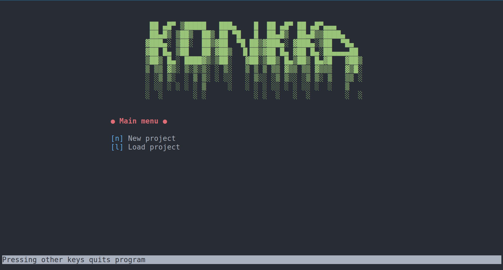

# Concourse – Share costs of a joint venture

With this command line tool it is possible to share costs of a joint
venture such as a holiday trip. Written using only Python 3 standard lib.
Linux terminal supported.

## Setting up

``` shell
git clone git@github.com:malmgrek/concourse.git
cd concourse && python app.py
```


